# Facial Emotion Recognition Using Deep Convolutional Neural Network

Team members\
Shanchao Liang (sliang53@wisc.edu), Zhaoyang Li (zli2344@wisc.edu)  
Qitong Liu (qliu227@wisc.edu), Shirley Liu (rliu326@wisc.edu)  

Link for presentation: https://github.com/Qliu227/CS639_FER/blob/gh-pages/presentation/CS639_FER.pptx

## 1. Motivation
Facial expression is an important communication tool for the human being, through which people can recognize others’ mental status, such as happiness, anger, sorrow, etc.[1] Among various facial emotion recognition (FER) methods, camera image has become a focused area because of its widespread application in daily life, such as Virtual Reality, advanced driver assistance systems (ADASs), education, and healthcare.[2] In light of this, the FER aroused our interest to study and implement some techniques.

Facial emotion recognition (FER) is achieved either by measuring the changes of various body parameters, such as measuring heart rate, eye activity, electroencephalography, etc or by analyzing the facial image.[1] And the latter has gained popularity because of the abundant and cost-effective computational resources. The research studies the FER based on input from the camera can be divided into two groups, conventional methods and approaches using neural networks.[1] The conventional FER method is based on hand-engineered features to identify facial emotion.[4] The typical process includes detecting the region of interest, extracting features and then using a pre-trained classifier to recognize the facial emotion, as shown in Fig.1.[1] The popular classifier includes SVM, random forest, and kNN. In contrast, the neural network uses the whole image as the input and it is processed by artificial neurons. It has emerged as a general approach for computer vision with the availability of big datasets. The classical CNN convolves the input image to generate feature maps, which are concatenated and then used for classification (see Figure 2).[1] Among published studies, Kim et al. proposed a hybrid model consisting of a CNN and long short-term memory (LSTM), and it has the highest performance with an accuracy of 78.61%. [3]

## 2. Methods
In this project, we will build a deep convolutional neural network (CNN) based on the model proposed by 
Aayush Mishra (https://www.kaggle.com/aayushmishra1512/emotion-detector), which consists of five CNN modules. The model contains about 4.5 million parameters. The batch normalization and dropout techniques are used to make the model robust. The detailed structure is shown in Fig.3. 

 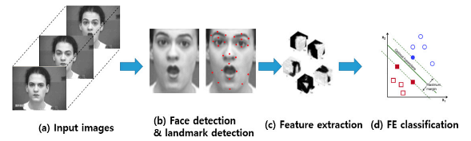 

 Figure 1. Conventional FER method.[1] 
  

 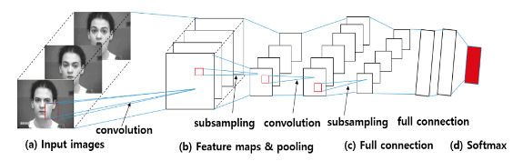 

 Figure 2. Deep neural networks-based FER approach.[1] 
  

 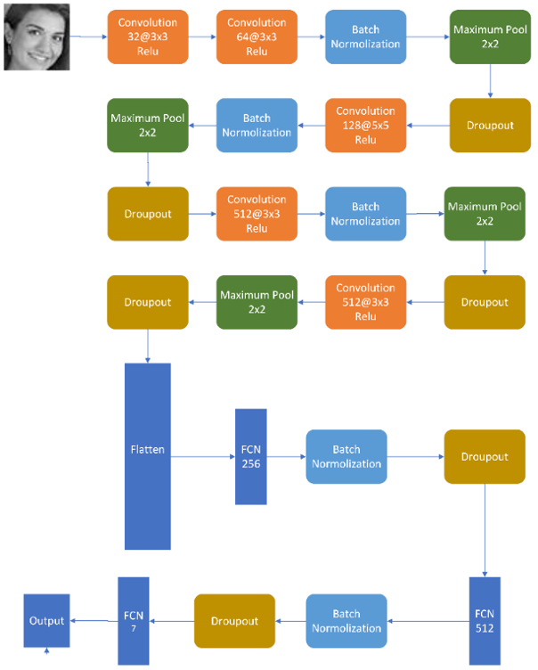 

 Figure 3. The architecture of CNN 
  

Several basic components and techniques adopted in the model are briefly reviewed. 
* Convolution: The convolution kernel is used to detect edges and thus, it is also called the filter. The convolution kernel has a locality attribute, and it focuses on local features. For example, the essence of edge detection with the Sobel operator is to compare the similarity of adjacent pixels of images.
* Activation: In the biological sense of neurons, only when the weighted sum of the signals transmitted by the previous dendrites is greater than a certain threshold, the subsequent neurons will be activated. Similarly, when the output cannot reach a certain standard or the feature in a certain area is very weak, then the feature intensity output should be 0, which is achieved by the activation function. Thus, areas not related to the feature will not affect the training of the feature extraction method. Relu is the most commonly used activation function, which was employed in this project.
* Pooling:[6] Pooling is a nonlinear downsampling method. After obtaining image features through convolution, these features are used for classification. Using all the extracted feature data to train the classifier is possible, but this usually results in a tremendous calculation. Therefore, the dimensionality of the convolutional features should be reduced by the maximum pool sampling method after acquiring the convolutional features of the image. The convolution feature is divided into several n×n disjoint regions, and the maximum (or average) feature in these regions is used to represent the convolution features after dimensionality reduction. These reduced-dimensional features are easier to classify. Maximum pool sampling reduces the computation complexity from intermediates layers, and these pooled units have translation invariance.
* Batch Normalization:[7] batch normalization is a preprocessing technique that is achieved before each layer of the network so that the activation data is standardized before the training starts. The network that uses batch normalization is more robust to bad initial values.
* Dropout: In some machine learning models, if the model has too many parameters and too few training samples. Dropout can effectively solve the overfitting problem by letting some hidden nodes fail randomly. The Dropout method enables the neuron to be activated with the probability of the hyperparameter p to set to 0. In this way, no matter how large the weight is updated, the weight will not be too large. In addition, the algorithm can also use a relatively large learning rate to speed up the learning speed so that the algorithm can search for better weights in a broader weight space without worrying about excessive weights.

## 3.Database
The Facial Expression Recognition 2013 (FER-2013) database was used in this project. The dataset includes 28,709 training samples and 3,589 validation samples. The facial expression image can be categorized into one of the seven categories (0=Angry, 1=Disgust, 2=Fear, 3=Happy, 4=Sad, 5=Surprise, 6=Neutral). Each sample is a 48×48 pixel grayscale image, which is already registered.
## 4. Results and Discussion
### 4.1 Training using the unbalanced dataset

 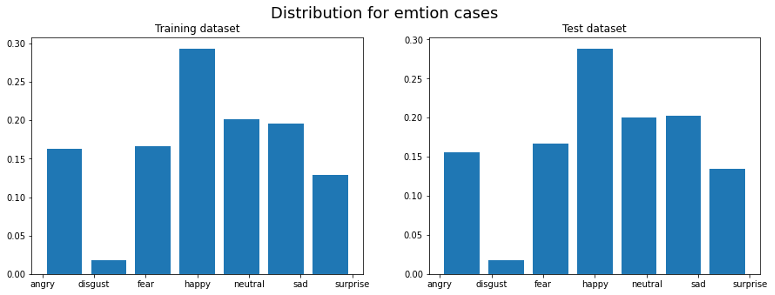 

 Figure 4. Distribution of facial emotion classes in the training dataset and testing dataset 
  

Figure 4 shows the facial emotion distribution for training and testing datasets. The training and testing dataset have a similar distribution. Among 7 emotions, the happy emotion has the highest portion, and it occupies ~30% of the total sample. The disgust emotion is relatively rare and only contains 3% of the total sample. The other 4 emotions (angry, fear, neutral and sad) have a comparable number of samples.

 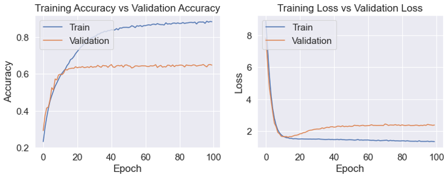 

 Figure 5. The evolution of accuracy and loss for training and validation dataset. 
  
  
The Python software was used with the TensorFlow library to build the CNN model. The model was trained on a local machine using GPU for 100 epochs. The history of accuracy and loss are shown in Fig. 5. The accuracy of the two groups initially increases with the epoch and then reaches a plateau. The accuracy of the two groups is close to each other until the 10th epochs, where the accuracy of the validation dataset becomes stable while the accuracy of the training dataset keeps increasing. Similarly, the loss of the two groups decreases and reaches the bottom at the 10th epoch. Training and validation dataset have a similar magnitude of loss until the 10th epochs,  where the loss of the training dataset keeps decreasing while the loss of the validation dataset suddenly increases. These two observations indicate the model is overfitted.

 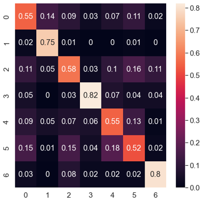 

 Figure 6. Confusion matrix of the trained CNN model. (0=Angry, 1=Disgust, 2=Fear, 3=Happy, 4=Sad, 5=Surprise, 6=Neutral）
  

Therefore, the final model is trained with 10 epochs, and its performance is evaluated using the validation dataset. The overall accuracy of the trained CNN model is 65%, which is comparable with the reference work. The confusion matrix of the trained CNN model is shown in Fig.6. The color patterns of the seven classes are close to each other, and the model predicts well with all testing categories. Among 7 categories, the model can predict 3rd and 6th classes (happy and neutral emotions) with ~80% of accuracy, while its forecasting on 5th class (surprise emotion) is the worst with only ~55% of accuracy. About 29% of surprise emotions is mistakenly labeled as fear and sad emotions.
### 4.2 Training using the balanced dataset
As shown in Fig.4, the number of images in each class in the original dataset is not equivalent, which may have a significant impact on the accuracy of each class. To study this, we employed two techniques, random undersampling and random oversampling, to make each emotion category have the same number of training images.
#### 4.2.1 Random undersampling method
The first approach to balance data is the random undersampling method, which is achieved by using the imblearn API function RandomUnderSampler. The number of images in each emotion case equals the number of images in the minority class, and the extra images are randomly selected and removed. The model parameters remain the same except that the training epochs are extended to 100 because fewer training images require extra epochs to converge.

 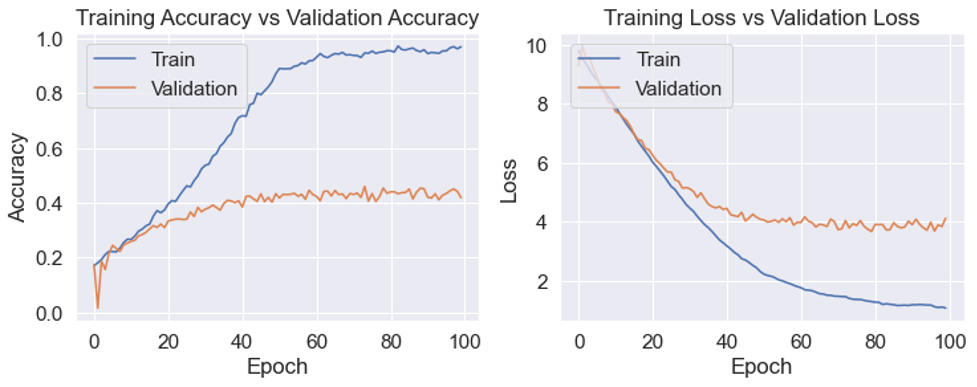 

 Figure 7. The evolution of accuracy and loss for training dataset and validation dataset using undersampled data. 
  

 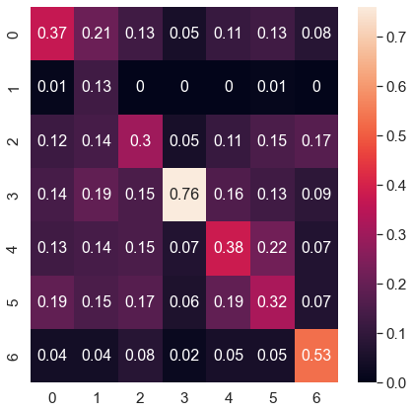 

 Figure 8. Confusion of the CNN model trained with undersampled data.(0=Angry, 1=Disgust, 2=Fear, 3=Happy, 4=Sad, 5=Surprise, 6=Neutral) 
  

Figure 7 shows the changes in the accuracy and loss in the training process. As expected, the model needs ~40 epochs to converge and the final accuracy is about 40%, which drops 62.5% when compared with the model using the original image. Figure 8 shows the confusion matrix of the model trained with undersampled data. The model has unsatisfied performance for all classes except the 3rd class (happy emotion).

#### 4.2.2 Random oversampling method
The second approach to balance data is using the oversampling method, which employs the imblearn API function RandomOverSampler. The number of images in each class equals the number of images in the majority class, and the extra image is generated by randomly replicating the existing images. The training epochs are reduced to 50 as the training dataset includes extra images.

 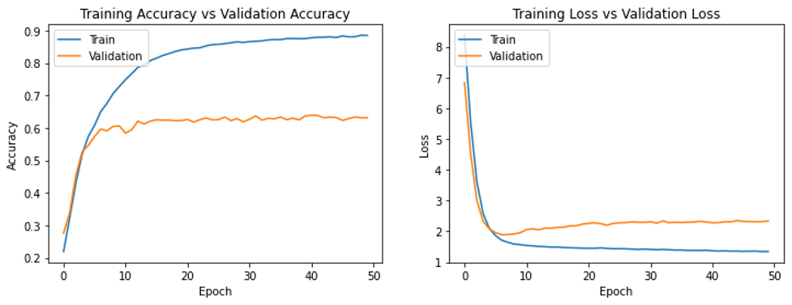 

 Figure 9. The evolution of accuracy and loss for training dataset and validation dataset using oversampled data. 
  

 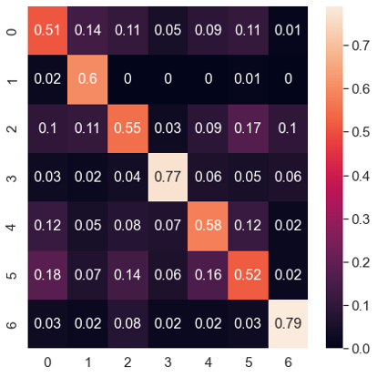 

 Figure 10. Confusion of the CNN model trained with oversampled data. (0=Angry, 1=Disgust, 2=Fear, 3=Happy, 4=Sad, 5=Surprise, 6=Neutral） 
  

Figure 9 and 10 shows the evolution of accuracy and loss and the confusion matrix for the model trained with oversampled data. The model needs 5 epochs to converge and the final accuracy is about 60%. The number of images in the 1st category increases the most, as well as its accuracy. However, the accuracy for other classes slightly decreases, resulting in overall decreases in performance.

### 4.3 Training using augmented data
Another popular tool that is used to augment the training image is the ImageDataGenerator function in TensorFlow. This function applies random changes to the images in the training dataset in each training epoch. The changes include shifting or flipping the image horizontally and vertically.

 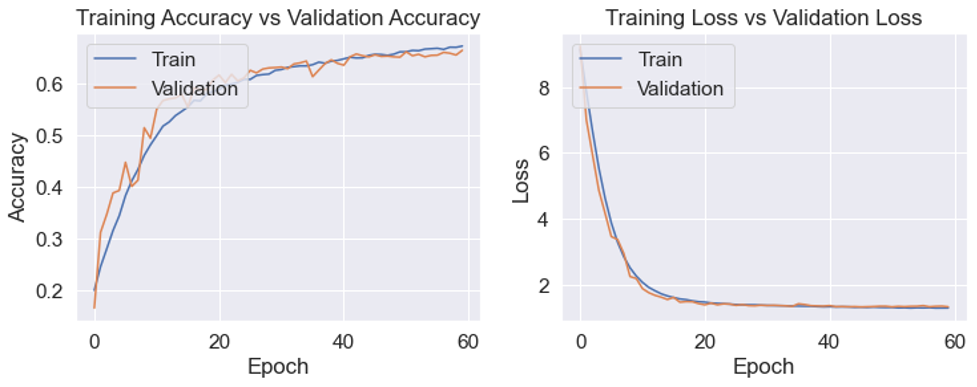 

 Figure 11. The evolution of accuracy and loss for training and validation dataset using augmented data. 
  

  

 Figure 12. Confusion of the CNN model trained with augmented data. (0=Angry, 1=Disgust, 2=Fear, 3=Happy, 4=Sad, 5=Surprise, 6=Neutral）
  

Figure 11 and 12 shows the training process and the confusion matrix of the model trained with augmented data. As the input image in each epoch is changing, the accuracy approaches 70% with 60 epochs. The confusion matrix does not show significant improvement.

### 4.4 Visualization of the trained CNN model 

 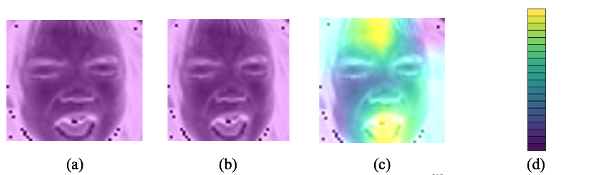 

 Figure 13. Visualization of the trained CNN model by Grad-CAM:[9] (a) 1st convolution layer; (b) 2nd convolution layer; (c) 3rd convolution layer; (d) viridis palette colormap 
  

The Gradient-weighted Class Activation Mapping (Grad-CAM) is employed to visualize the trained model.[9] The Grad-CAM performs a backward pass to obtain the gradient of the feature map and obtains the gradient corresponding to each pixel on each feature map. This gradient feature map is then normalized, and the average value of all gradient maps shows the importance of each pixel. The Viridis palette colormap is used to show the importance of the pixel. The light color yellow shows the important pixels and the dark color purple represents the least important pixels. As shown in Figure 12, an image labeled as fear emotion is used to visualize the trained CNN model. After proceeding the first two convolution layers, there is no significant pixel in the image. However, after passing the third convolution layer, important neurons are identified located around the mouth and forehead, which are the important features when recognizing fear emotion.

## Reference
1. Ko, B. C. (2018). A brief review of facial emotion recognition based on visual information. sensors, 18(2), 401.
2. Naga, P., Marri, S.D. and Borreo, R., 2021. Facial emotion recognition methods, datasets and technologies: A literature survey. Materials Today: Proceedings.
3. Ebrahimi Kahou, S., Michalski, V., Konda, K., Memisevic, R., & Pal, C. (2015, November). Recurrent neural networks for emotion recognition in video. In Proceedings of the 2015 ACM on international conference on multimodal interaction (pp. 467-474).
4. Kim, D. H., Baddar, W. J., Jang, J., & Ro, Y. M. (2017). Multi-objective based spatio-temporal feature representation learning robust to expression intensity variation	s for facial expression recognition. IEEE Transactions on Affective Computing, 10(2), 223-236.
5. Mollahosseini, A.; Chan, D.; Mahoor, M.H. Going deeper in facial expression recognition using deep neural networks. In Proceedings of the IEEE Winter Conference on Application of Computer Vision, Lake Placid, NY, USA, 7–9 March 2016; pp. 1–10
6. Ioffe, S., & Szegedy, C. (2015, June). Batch normalization: Accelerating deep network training by reducing internal covariate shift. In International conference on machine learning (pp. 448-456). PMLR.
7. Srivastava, N., Hinton, G., Krizhevsky, A., Sutskever, I., & Salakhutdinov, R. (2014). Dropout: a simple way to prevent neural networks from overfitting. The journal of machine learning research, 15(1), 1929-1958.
8. Zhou, B., Khosla, A., Lapedriza, A., Oliva, A., & Torralba, A. (2016). Learning deep features for discriminative localization. In Proceedings of the IEEE conference on computer vision and pattern recognition (pp. 2921-2929).
9. Selvaraju, R. R., Cogswell, M., Das, A., Vedantam, R., Parikh, D., & Batra, D. (2017). Grad-cam: Visual explanations from deep networks via gradient-based localization. In Proceedings of the IEEE international conference on computer vision (pp. 618-626).
